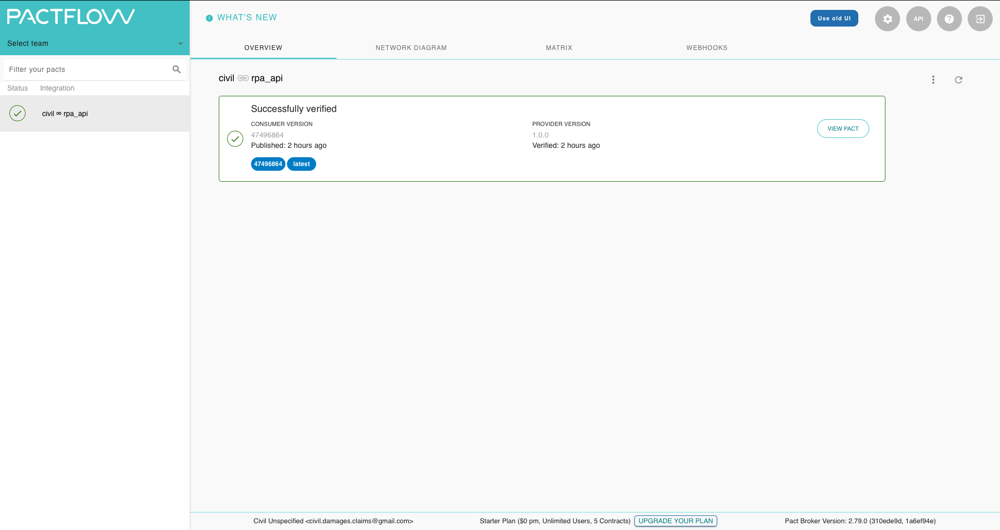

# rpa-contract-test

## Getting Started
This tool is used to verify Pact contracts that have been publish to the Pactflow platform, by the Civil Damages team. Pact contracts, are versioned. Specific pact versions can be verified using this tool. Upon verification, all the tests that form the contract will lead to emails being sent to the robotics at an email address, that can be provided by the user.

The Pactflow portal can be accessed via the following link: https://civil-damages-claims.pactflow.io

To access the portal, credentials are required which can be acquired by contacting the Civil Damages team.

To use the command line interface, the API token for the platform is required, which can also be retrieved from the Civil Damages team.
### Prerequisites

Running the application requires the following tools to be installed in your environment:

  * [Node.js](https://nodejs.org/) v12.0.0 or later
  * [yarn](https://yarnpkg.com/)
  * [git (and git bash for Windows)](https://git-scm.com/download)

### Instructions
When you sign in to the Pactflow portal, you will see a screen similar to the following:



You can view details of a Pact contract by clicking on "View Pact".

To see different versions of Pact Contracts that have been published, you can click on the tab "Matrix".

To use this on a Windows machine, please open Git Bash.

To verify a Pact contract, use the following command:

```bash
$ ./run.sh
```
You will be prompted for the consumer pact tag version.

If you do not specify a consumer pact tag version, it will look for pacts tagged with 'latest'.
```bash
Please enter the consumer pact tag version:

```


You will then be prompted for the email address of the robot:
```bash
Please enter the robotics email address:

```
Finally, you need to supply the API Token that will be provided by the Civil Damages Claims team.
```bash
Please enter Pact broker API Token:

```

After this the pact verification will be carried out, and the email will be sent.

---
* For more technical information, please look at [this README.](./READMEDEVS.md)

